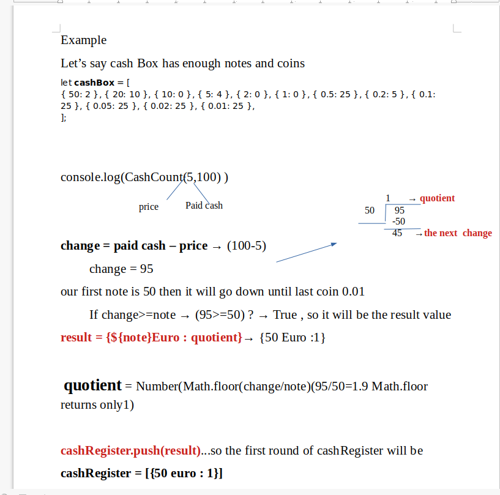
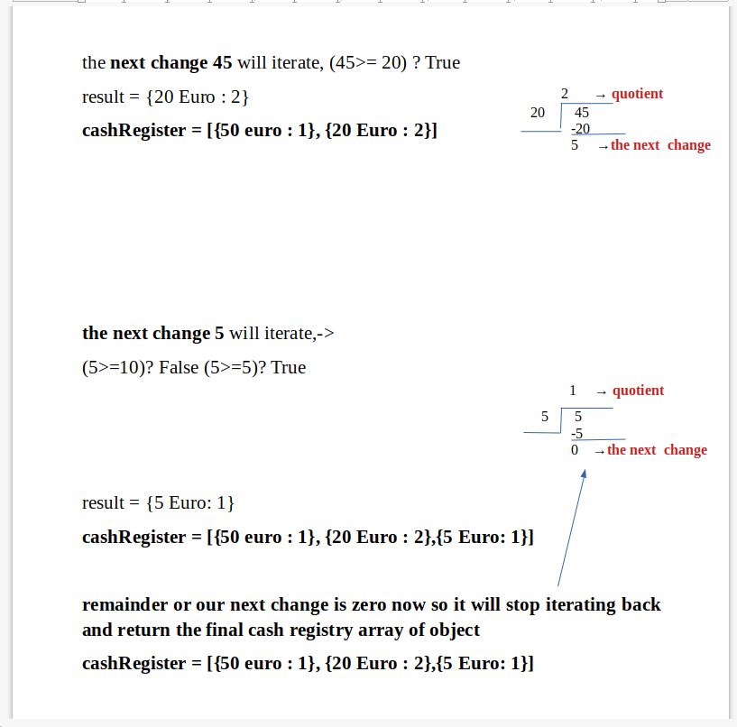

# The Cashier

## what does it do?

- helps a cashier give adequate change to customers
- should return the amount of notes and coins for the customer's change.

## Cases

- if price and the payment is equal, it will return `Payment done print the receipt?`
- if the persons pays less amount of the price it will calculate the remaining amount and return a message `price - paidCash + " more euro should be paid"`

- if cashBox has less than the change that should be returned , it will check and return a message `We don't have enough in the cash box`.
- if the cashBox is empty ,it will inform us `Empty cash box`
- if the cashBox is out of any of the denominations (either note or coins ) it will return the change with available denominations

## Example

